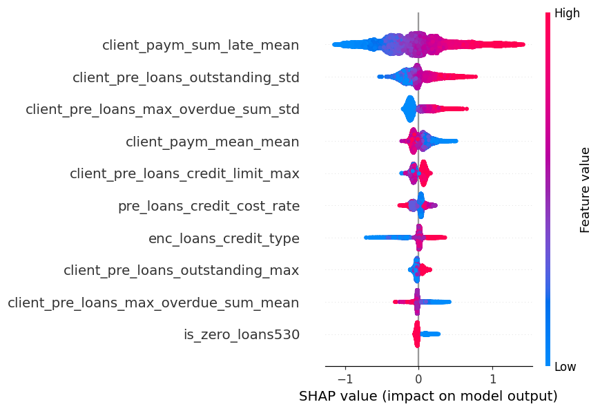
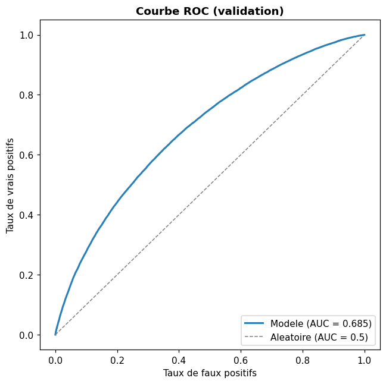
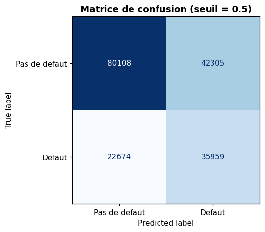
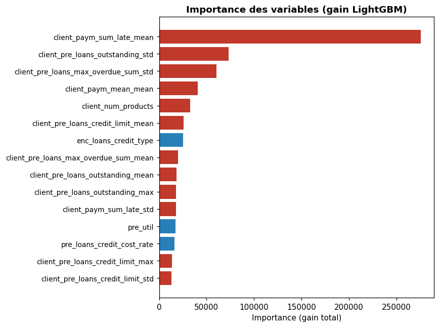

# Prédiction du risque de défaut de crédit - Data Tour Afrique 2025


## TL;DR

- **Problème** : prédire si un prêt va faire défaut, à partir de l'historique de crédit d'un client (17,6M lignes, 2,9M clients).
- **Approche** : un pipeline simple et honnête - feature engineering (historique de paiement, ratios financiers, agrégats client), LightGBM avec hyperparamètres par défaut (aucun réglage arbitraire), validation **groupée et stratifiée par client**. Le notebook démontre d'abord, concrètement, le piège d'un split naïf avant de construire le split correct.
- **Résultat : ROC AUC ≈ 0.685** en validation, un score réaliste, sans exploiter les fuites de données qui gonflent artificiellement certains scores dans ce type de compétition (voir plus bas).
- **Bonus** : une section dédiée montre, décompose et explique honnêtement le mécanisme derrière les scores > 0.99 parfois observés dans ce type de compétition, plutôt que de l'utiliser pour gonfler le résultat principal.

📄 [Rapport de synthèse (PDF)](reports/rapport_data_tour_2025.pdf)



## Contexte

Le jeu de données brut compte **17,6 millions de lignes** (chacune représentant un produit de
crédit) et **62 colonnes** encodées, pour environ **2,9 millions de clients**. La cible (`flag`)
est très déséquilibrée (~3,5% de défauts) et définie en réalité **au niveau du client** (elle est
identique pour toutes les lignes d'un même client — un point central du projet, voir plus bas).

Ce projet reprend et améliore, après la compétition, le travail initial réalisé pendant le Data
Tour 2025, en intégrant des retours d'expérience et de bonnes pratiques de scoring de crédit
identifiées a posteriori. Il ne vise pas le score le plus élevé possible à tout prix, mais un
**juste milieu entre simplicité et performance**.

## Résultat

- Modèle : **LightGBM** unique (pas d'ensembling), hyperparamètres **par défaut** (aucun réglage
  manuel arbitraire). Seuls `scale_pos_weight` (déséquilibre des classes) et l'**early stopping**
  (arrêt automatique de l'entraînement) sont ajoutés, tous deux justifiables. Entraîné sur un
  échantillon stratifié de 150 000 clients pour rester rapide et reproductible.
- Validation : split **groupé par client et stratifié par flag**, construit après avoir démontré
  concrètement (section 6 du notebook) le piège d'un split naïf classique sur ce jeu de données,
  un split stratifié au niveau ligne laisse 60% des clients partagés entre train et validation, ce
  qui gonfle artificiellement le score à 0.72 au lieu de ~0.685.
- **ROC AUC en validation : ≈ 0.685**, un score réaliste et défendable pour une approche simple
  à un seul modèle. C'est le résultat principal retenu pour ce projet.

<p align="center">
  
</p>

**Évaluation complémentaire** : au-delà de l'AUC, une matrice de confusion et un rapport de
classification (seuil = 0.5, sur l'échantillon rééquilibré) traduisent ce score en termes concrets. 
Environ 61% des vrais défauts sont détectés (recall), pour 46% de précision sur les alertes.

<p align="center">
  
</p>

**Interprétabilité** : au-delà de l'importance par gain (graphique ci-dessous), une analyse
**SHAP** (librairie `shap`, `TreeExplainer`) montre le sens et la distribution de l'effet de
chaque variable, pas seulement son importance moyenne. Les agrégats au niveau client dominent
largement dans les deux cas.

<p align="center">
  
</p>

**Étape complémentaire (historique client)** : une variable additionnelle exploite le fait qu'un
même client peut avoir plusieurs prêts (encodage *leave-one-out* du taux de défaut par client).
Elle fait grimper l'AUC global à ≈ 0.9999, mais le notebook décompose ce chiffre : AUC = 1.0 sur
les 97,9% de lignes où le client a un autre prêt connu (le flag est en réalité identique pour tous
les prêts d'un même client. Ce n'est donc pas un progrès du modèle, mais une "relecture" de
l'historique), contre AUC = 0.68 sur les clients réellement nouveaux, cohérent avec le score de
base. Cette section documente et explique honnêtement ce mécanisme (celui qui explique les
scores >0.99 parfois observés dans ce type de compétition), sans l'utiliser pour gonfler
artificiellement le résultat principal.

**Recherche d'hyperparamètres** : testée séparément avec Optuna (jusqu'à 60 essais). Gain observé
entre +0.002 et +0.004 d'AUC, marginal et du même ordre de grandeur que la variabilité naturelle
d'un run LightGBM à l'autre. Non retenue comme modèle principal pour rester simple.

Détails complets (EDA, feature engineering, méthodologie, discussion des résultats) dans le
notebook.

## Structure du dépôt

```
.
├── data/raw/data.parquet        # Données brutes (suivies via Git LFS)
├── notebooks/
│   └── credit_default_prediction.ipynb   # Pipeline complet : EDA -> features -> modèle -> évaluation -> SHAP
├── reports/
│   ├── rapport_data_tour_2025.pdf         # Rapport de synthèse (PDF)
│   └── figures/                           # Graphiques (ROC, matrice de confusion, importances, SHAP)
├── requirements.txt
└── README.md
```

## Installation

```bash
git lfs pull        # pour récupérer data/raw/data.parquet
pip install -r requirements.txt
jupyter notebook notebooks/credit_default_prediction.ipynb
```

## Méthodologie (résumé)

1. **Exploration** : pas de valeurs manquantes ni de doublons (vérifié sur les 17,6M lignes,
   y compris entre row groups), cible très déséquilibrée et définie au niveau du client.
2. **Échantillonnage stratifié par client** (150k clients) pour un projet exécutable rapidement ;
   le pipeline s'applique tel quel au jeu complet.
3. **Feature engineering** :
   - agrégats sur l'historique de paiement (`enc_paym_0` à `enc_paym_24`) : moyenne, écart-type,
     tendance récente vs ancienne, plus longue séquence de retard ;
   - ratios financiers (encours/plafond, impayés/plafond, ...) ;
   - agrégats par client (`groupby("id")`) : la famille de variables la plus prédictive ;
   - suppression des colonnes à risque de fuite (connues seulement à la clôture d'un prêt).
4. **Démonstration du piège d'un split naïf** : un split classique stratifié par `flag` (au
   niveau ligne) laisse 60% des clients partagés entre train et validation, gonflant l'AUC à 0.72.
5. **Validation retenue** : split groupé par client **et** stratifié par `flag`, garantissant à la
   fois l'absence de fuite et un taux de défaut comparable des deux côtés.
6. **Modèle** : LightGBM avec hyperparamètres par défaut, `scale_pos_weight` pour le déséquilibre
   et early stopping.
7. **Évaluation** : ROC AUC, matrice de confusion et rapport de classification.
8. **Interprétabilité** : analyse SHAP (librairie `shap`, `TreeExplainer`) pour comprendre le sens
   de l'effet de chaque variable, en complément de l'importance par gain.
9. **Étape complémentaire (bonus)** : encodage leave-one-out du taux de défaut par client
   (`groupby("id")`, en excluant la ligne courante), pour exploiter les cas où un client a
   plusieurs prêts. Décomposée et expliquée plutôt que présentée comme un simple gain de score.
10. **Recherche d'hyperparamètres (Optuna)** : testée séparément, gain marginal, non retenue.

## Pistes d'amélioration

- Entraînement sur le jeu de données complet.
- Validation croisée `GroupKFold` à K plis plutôt qu'un split unique.
- Ensembling léger (LightGBM + CatBoost + méta-modèle) — gain généralement modeste dans ce type
  de problème, non testé ici.
- En production, exposer séparément les métriques clients connus / nouveaux clients plutôt qu'un
  score global.

## Auteur

Laté LAWSON — Data Tour Afrique 2025.
